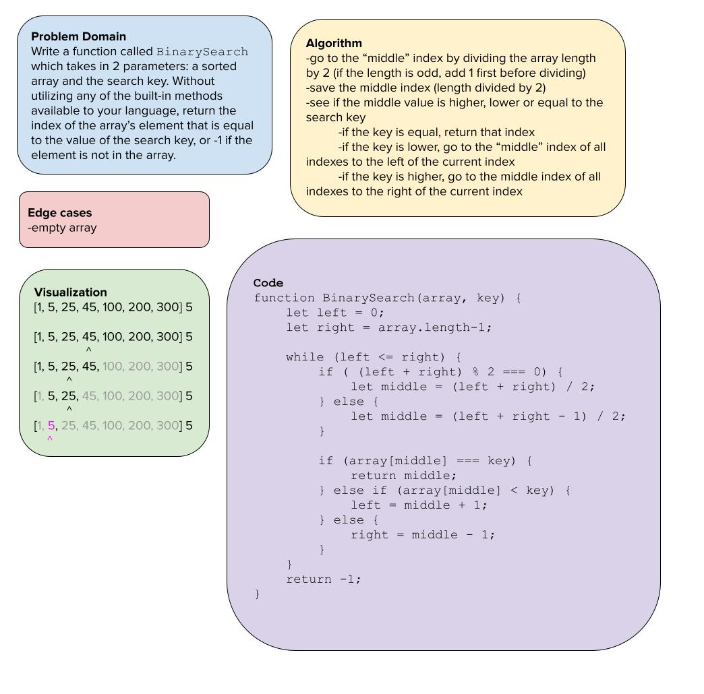

> # Binary Search of Sorted Array

Write a function called `BinarySearch` which takes in 2 parameters: a sorted array and the search key. Without utilizing any of the built-in methods available to your language, return the index of the array’s element that is equal to the value of the search key, or -1 if the element is not in the array.

> ## Whiteboard Process

> ## Approach & Efficiency

I thought this was going to be an easy code challenge until I figured out what binary searches are! I was able to hone on establishing a middle point, but I struggled with how to set the boundaries of the search, especially within the bounds of a while loop. I considered rebuilding the array as needed -- even though that didn't seem like the most efficient approach -- but realized that the indexes need to stay intact in order to return the correct index if the search key is found in the array. I Googled some examples of binary searches and realized that it's as simple as setting the left and right boundaries at the far ends, and then adjusting them when a match isn't found. The key point is that when you need to search "higher" or to the right, you set your leftmost boundary just to the right of the current middle. And conversely, when you need to search "lower" or to the left, you set your rightmost boundary just to the left -- that was the key concept. I also made use of the modulus operator to get around using Math.floor() but I could easily explain what that method does.
