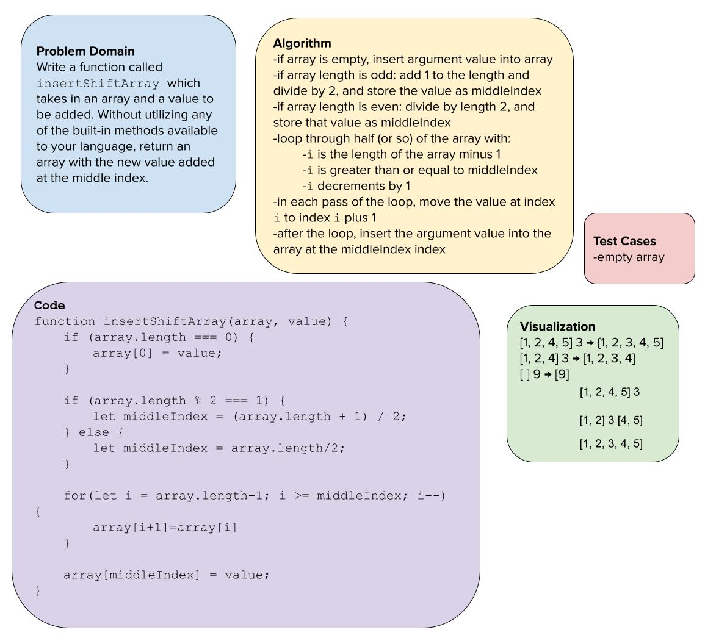

> # Insert to Middle of an Array
Write a function called `insertShiftArray` which takes in an array and a value to be added. Without utilizing any of the built-in methods available to your language, return an array with the new value added at the middle index.

> ## Whiteboard Process

> ## Approach & Efficiency
Pretty quickly I knew that I wanted to only shift "half" of the elements in the array -- the other half or so don't need to be moved in order to make room for the newly inserte value. I decided to work on the second half of the array because per the instructions there's a slight bias towards inserting to the right, so this I think would mean slightly fewer elements to shift. And since I was working on the "back" side of the array, I worked from the back to the middle, so that it wasn't necessary to store off any values: a value would be shifted to the right, and it would leave an undefined element in its place, which would be soon be overwritten anyway with a new value shifting to the right. As I was coding I realized I overlooked some edge cases or edge logic involving small arrays, with lengths of 1, 2, and maybe also 3, but I adjusted my for loop condition accordingly.
