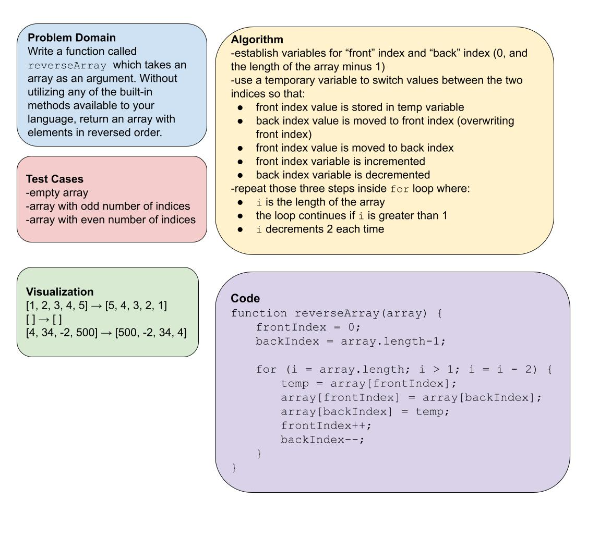

> # Reverse an Array

Write a function called `reverseArray` which takes an array as an argument. Without utilizing any of the built-in methods available to your language, return an array with elements in reversed order.

> ## Whiteboard Process

> ## Approach & Efficiency

My approach reverses the array in place -- without creating any additional arrays -- and updates two indices in each pass of the loop. I considered an approach that takes the second-to-last value and moves it to the back, (then 3rd-to-last, 4th-to-last, etc.) but even if that is possible within the same array, I think it requires handling an increasing number or set of values, so the swap method that was demo'd in class seems to be the simpler and more efficient approach.
