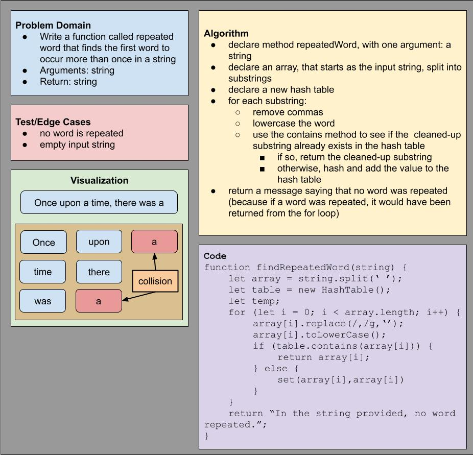

# Challenge Summary

Write a function called repeated word that finds the first word to occur more than once in a string

- Arguments: string
- Return: string

> ## Whiteboard Process

> ## Approach & Efficiency

At first I was wondering why a hash table is needed at all: In order to create a hash table -- with Big O time of O(1) -- we'd need to create an array and traverse it, which would be Big O time of O(n). But even if we simply used an array and no hash table, we'd probably need to traverse the array again, and possibly in more complicated ways, to locate repeated words. So the hash table at least avoids O(n) being used twice.

My approach usses some existing HashTable methods such as `set` and `contains`: Use `contains` to see if the word is a duplicate and if it is, you're done -- if not, then `set` the word into the hash table.

The important distinction is that for this hash table, the initial key and its value are the exact same thing. This allows `contains` to do the checking: If the key is already in the hash table, then the value is also already in the hash table, and that value is a repeated word.

> ## Solution

Code is available in the file `hashtable-repeated-word.js`.
