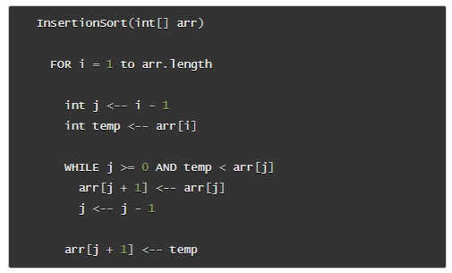

> # Insertion Sort

Looking at this psuedo code, the function goes through an input array and orders the integer elements of that array from smallest to largest. But it takes some decoding of the code to see how exactly it works:

We start with a for loop, which is a standard way of traversing through an array. This one is slightly different because `i` starts at 1 rather than 0, which gives us a hint for later.

Another index-tracking variable `j` starts at 0, and in each pass of the for loop, it resets to being one less than `i`. This is the part of the logic that compares two adjacent array elements -- or at least sets them up to be compared.

Early on we also save off the element "on the right" -- in the `temp` variable.

Our while loop has two conditions: `j` can't be less than 0, and the value in a certin index spot must be lower than the value in a certain other index spot. Tracking down the `temp` variable, we remember that we used it to store the right-side value (`arr[i]`). And `arr[j]` always reset to being one index to the left of `arr[i]` -- because `j` always resets to being one less than `i`. So if you compare two numbers, and the one on the right is smaller, that meets one of the conditions of the while loop.

In the while loop itself, we see the right-side index taking on the value from the left-side index. For a moment, we end up with one value overwriting the value to its right. Then, `j` is decremented, and used to assign that saved `temp` value to the left-size index. The result is that the two values switch places/indexes.

Having `j` be no lower than 0 (to enter the while loop) also ensures that when `j` is decremented to assign a value to the left-side index, that index must exist: `j` is 0 or higher, it goes up 1 and down 1, and thus cannot fall below 0, which is the lowest possible index.

Here's a visualization of the initial run through the while loop (with input array `[8, 4, 23, 42, 16, 15]`) and a fast-forward of the later loops:

We start with the input array, and `j` and `i` looking at the first two indexes. The 4 at index `i` is saved off, and 4 is less than 8, so we go right into the while loop. Once inside, the 8 from the left-side index overwrites the 4 in the right-side index. Then `j` is decremented and use to point to the placement of the 4 that was saved in the `temp` variable. And just like in the psuedo code, the result is that two numbers (where the second is lower than the first) swap places.

 The for loop keeps moving `j` and `i` to the right, and in additional passes of the while loop, the pattern is the same:

- the right-side (smaller) number is stored

- the left-size (larger) number is copied over to the right

- the `j` pointer is moved to the left-side index

- the saved (smaller) number is dropped into that left-side index
