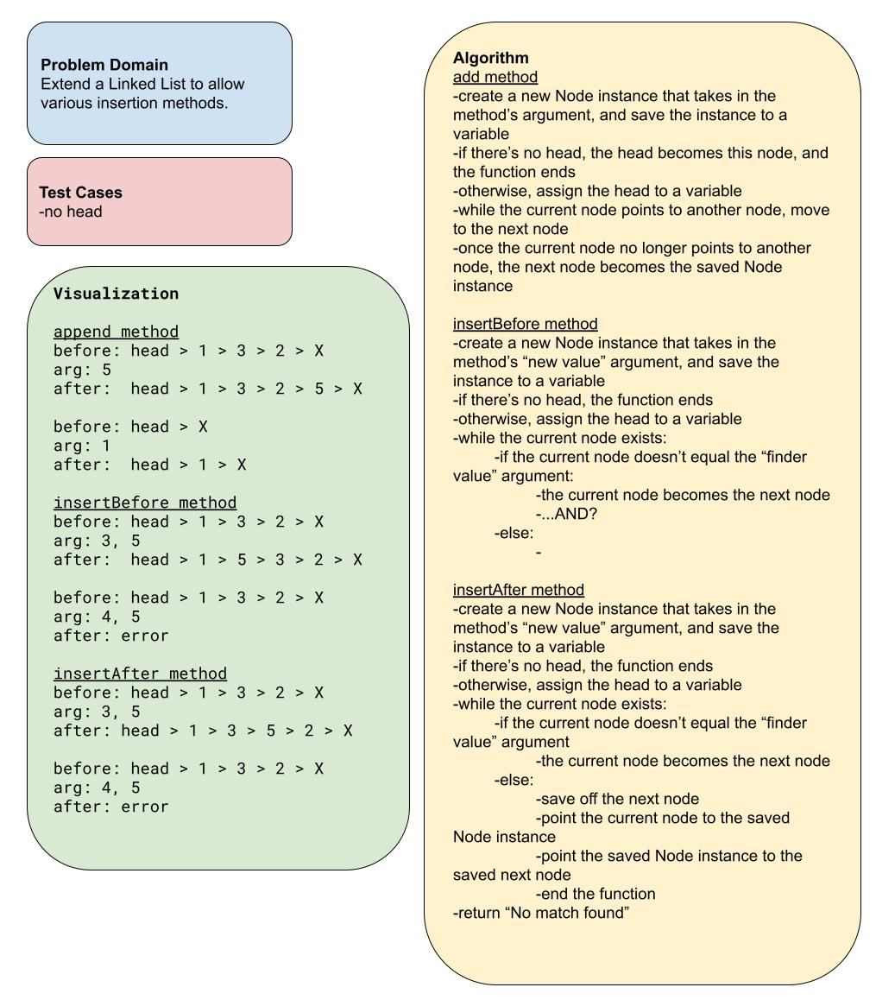

# Challenge Summary

Extend a Linked List to allow various insertion methods.

## Whiteboard Process

## Approach & Efficiency

There weren't too many competing options -- traversing a linked list generally means finding the head and moving forward until conditions are met. Traversing wants to reach the end of a linked list, appending wants to get to the end and append, but the insert methods don't necessarily reach the end. The two insert methods do achieve a lot of the same, but I wasn't able to quickly modularize them. I believe the Big O was O(1).

## Solution

Code is available in the file linked-list-insertions.js.
