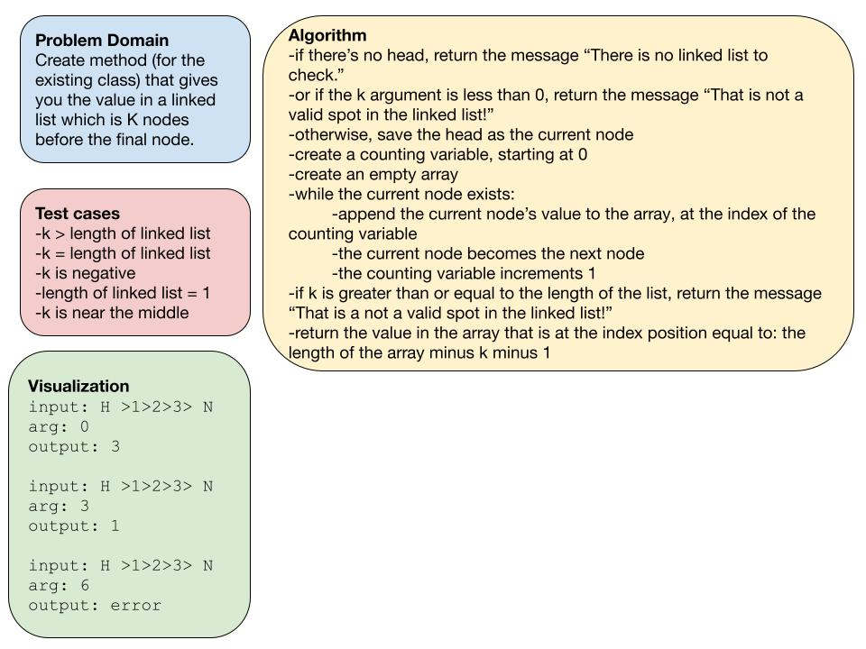

# Challenge Summary

Extend the linked list class with a method that gives you the value in a linked list which is `k` nodes before the final node.

## Whiteboard Process

## Approach & Efficiency

As far as I know, the only way to traverse a linked list is go through it once, so I decided to use that required traversal to spin off an array that has all of the values in the linked list -- so that no secondary traversal was needed. Then it was figuring out the calculation to grab the correct value from the array using the `k` input -- Big O time and space of O(n).

## Solution

Code is available in the file `linked-list-kth.js`.
