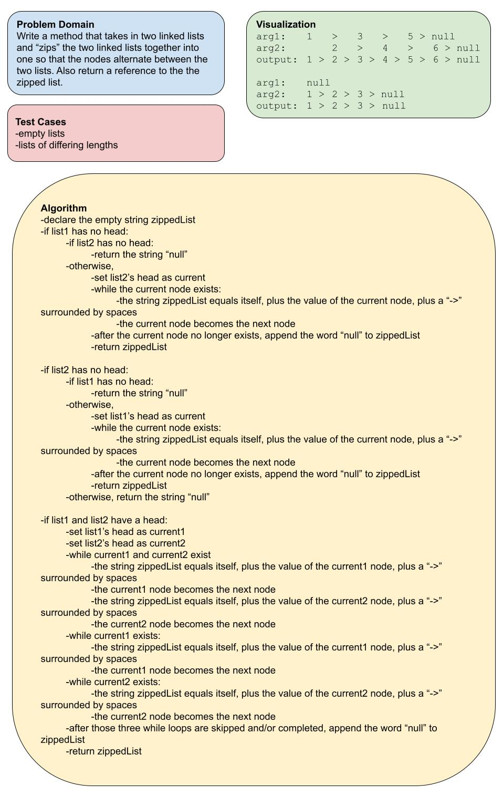

# Challenge Summary

Extend the linked list class with a method that that takes in two linked lists and “zips” the two lists together into one, so that the nodes alternate between the two lists. Also return a reference to the zipped list.

## Whiteboard Process

## Approach & Efficiency

I'm not sure if I kept additional space down to O(1), but I used the solution that seemed to use the least amount of space -- a single string for my return value. My overall approach seemed straightforward: traverse every single node (alternating between lists as needed) and tally all of the values in a string. But the configuration of my if and while statements centered around how to hand off between different focuses: neither list, both lists, and a single list -- because combinations of those might be needed. I couldn't figure out a clean way of nesting while loops, and it also seemed perhaps best to use some if statements to handle the cases where one or both lists are empty. Looking back at my solution, there is an amount of code repetition, but it's rather minimal, and I think the gains from modularization would be minimal as well.

## Solution

Code is available in the file `linked-list-zip.js`.
