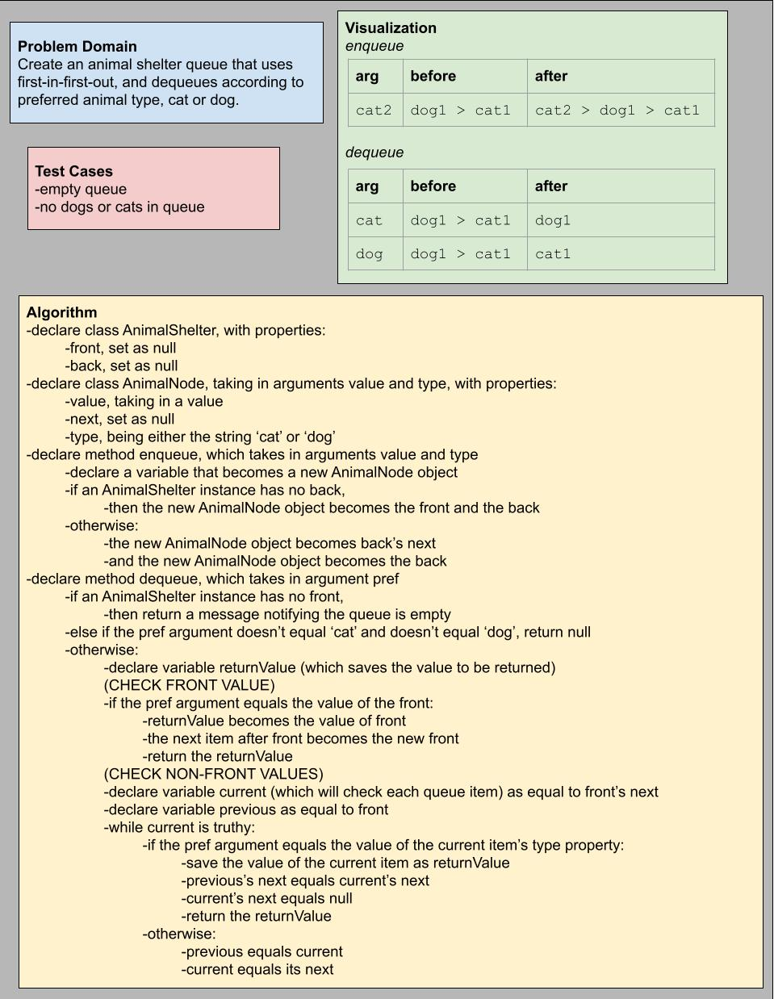

# Challenge Summary

Create an animal shelter queue that uses first-in-first-out, and dequeues according to preferred animal type, cat or dog.

## Whiteboard Process

## Approach & Efficiency

In terms of efficiency there didn't seem to be many options: handling this as a queue seemed best, and so enqueueing was O(1), but because the dequeueing doesn't necessarily take the front item, it had to be O(n).

My approach was to simply add a cat-or-dog property to each "animal node" so that when the dequeue method runs with its preference argument, we can compare the argument to the object property and know whether to dequeue that item or look further in the queue. Each edge case or obstacle that I ran into was generally solved with if statements, or creating some different logic for handling certain situations versus others. But in general, the dequeueing still seems to work from front to back, with a while loop being the central logic, and everything else being edge/test case logic that handles oddities outside of the while loop.

## Solution

Code is available in the file `stack-queue-animal-shelter.js`.
