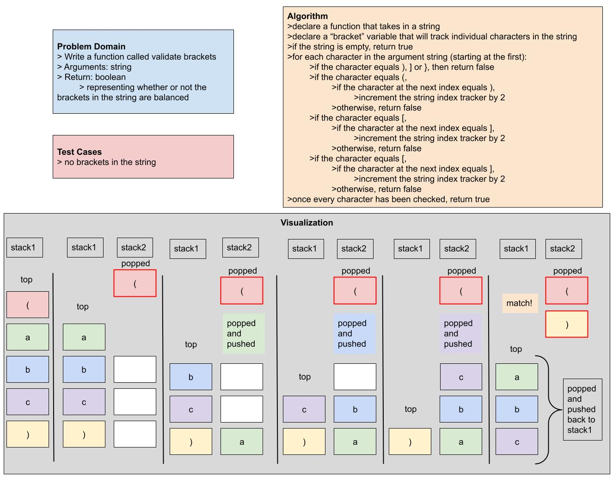

# Challenge Summary

- Write a function called validate brackets
- Arguments: string
- Return: boolean
  - representing whether or not the brackets in the string are balanced

## Whiteboard Process

## Approach & Efficiency

## Solution

Code is available in the file stack-queue-brackets.js.
