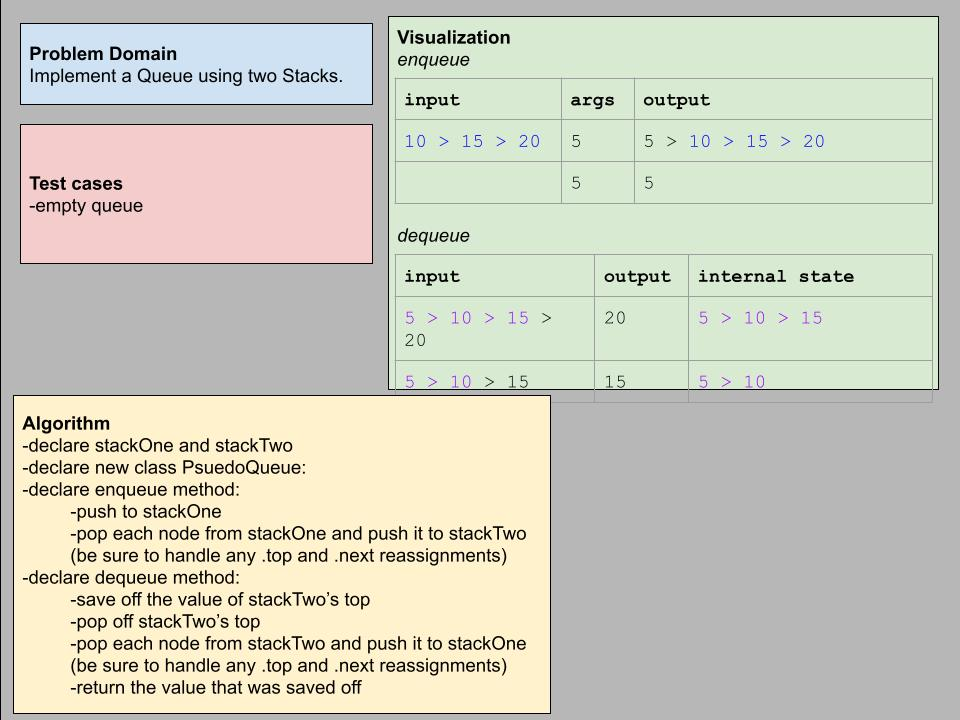

# Challenge Summary

Implement a Queue using two Stacks.

## Whiteboard Process

## Approach & Efficiency

Once I realized the trick of using the two stacks to reverse the top-to-bottom ordering of the nodes, I mainly had to work out how to configure the stacks so they would match first-in-first-out logic. I believe I achieve this by letting the enqueue method "enqueue" into one stack and then prep the second stack for dequeue. And the dequeue method "dequeues" from the second stack and then preps the first stack for any more enqueueing. I'm also trying to re-use my push and pop methods because that is much of what these pseudo enqueue and dequeue methods do.

## Solution

Code is available in the file `stack-queue-pseudo.js`.
