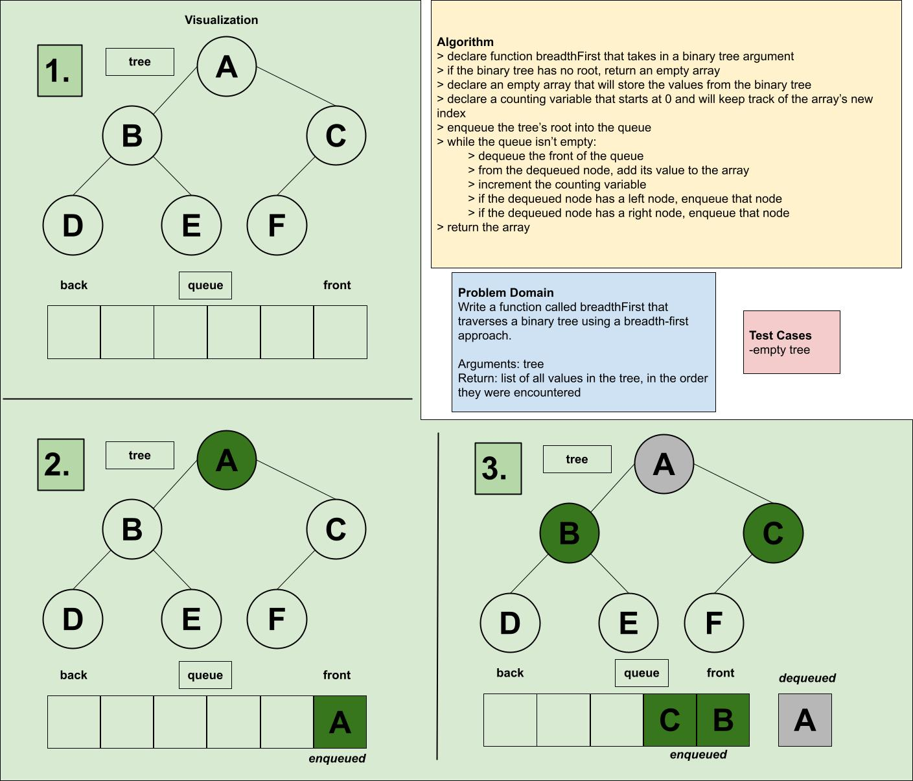

# Challenge Summary

Write a function called breadthFirst that traverses a binary tree using a breadth-first approach.

- Arguments: tree
- Return: list of all values in the tree, in the order they were encountered

> ## Whiteboard Process

> ## Approach & Efficiency

I referenced breadth-first traversal, and with the use of a queue the approach becomes clear. A single traversal allows for the queue to be populated and output -- in this case, as an array. I made a small assumption that the input is a binary tree and not a k-ary tree. And I decided against outputting a string because I'm not sure that outputting an array increases the Big O space, and an array of ordered values is much more useful than a string. Big O time is O(n), and I believe Big O space is also O(n) because the values must be stored in something in order to be returned.

> ## Solution
Code is available in the file `tree-breadth-first.js`.
