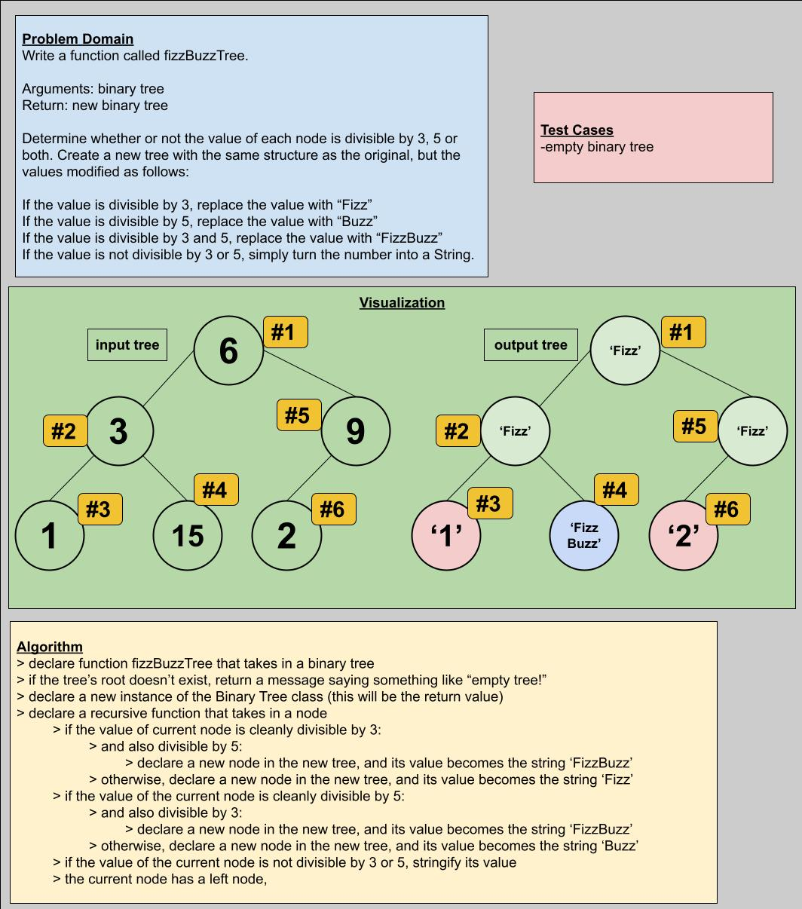

# Challenge Summary

Write a function called fizzBuzzTree.

- Arguments: binary tree
- Return: new binary tree

Determine whether or not the value of each node is divisible by 3, 5 or both. Create a new tree with the same structure as the original, but the values modified as follows:

- If the value is divisible by 3, replace the value with “Fizz”
- If the value is divisible by 5, replace the value with “Buzz”
- If the value is divisible by 3 and 5, replace the value with “FizzBuzz”
- If the value is not divisible by 3 or 5, simply turn the number into a String.

> ## Whiteboard Process

> ## Approach & Efficiency

I'm guessing that any depth-first recursive traversal would have worked, but pre-order still seemed safest. I struggled for a while with the need to bring in a tree as an argument, but even after believing I was finished I realized that I was altering the input tree in order to create the new tree. I figured out how to make a deep copy, so that a truly new tree was being returned. Big O time and space were O(n), pretty standard for a depth-first traversal.

> ## Solution

Code is available in the file `tree-fizz-buzz.js`.
