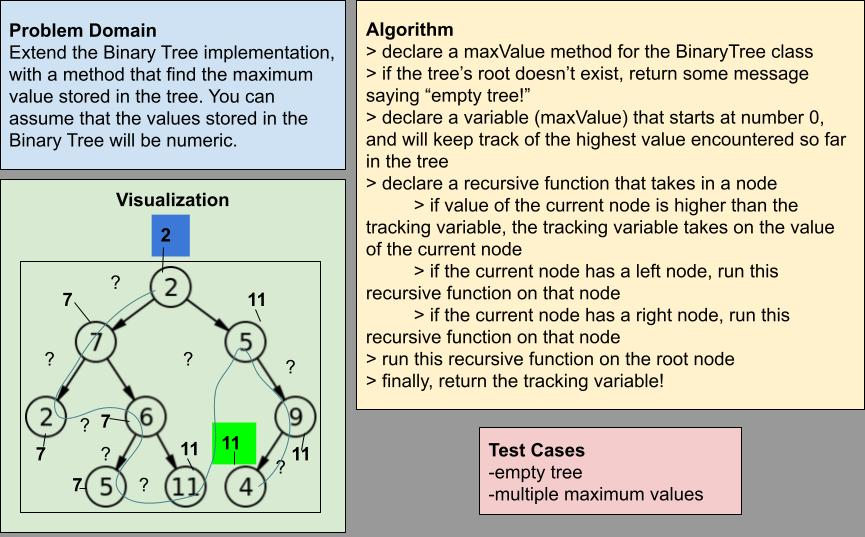

# Challenge Summary

Write the following method for the Binary Tree class:

- find maximum value
  - Arguments: none
  - Returns: number

Find the maximum value stored in the tree. You can assume that the values stored in the Binary Tree will be numeric.

> ## Whiteboard Process

> ## Approach & Efficiency

This method seems to be well-suited for another recursive function -- like in the preOrder, inOrder and postOrder methods -- so I leaned into that approach. Big O time is O(n) because this traversal may need to hit every node -- no guaranteed chance of a lower limit like O(width) or O(height). But at least Big O space is O(1) because we're only ever returning one number (or one string for error/edge cases).

> ## Solution

Code is available in the file `tree-max.js`.
